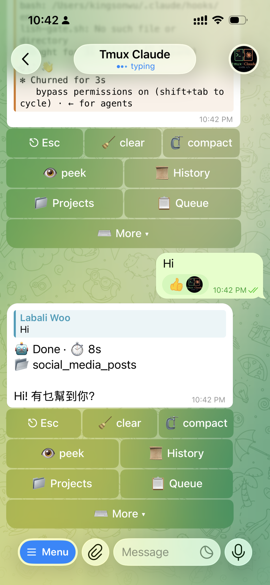
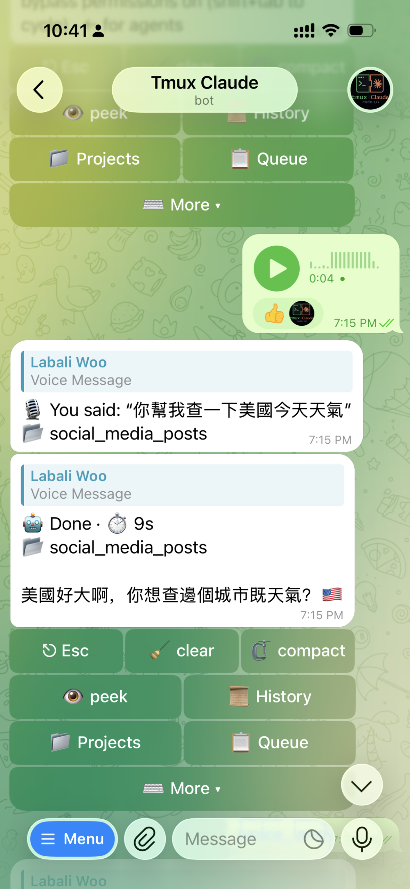
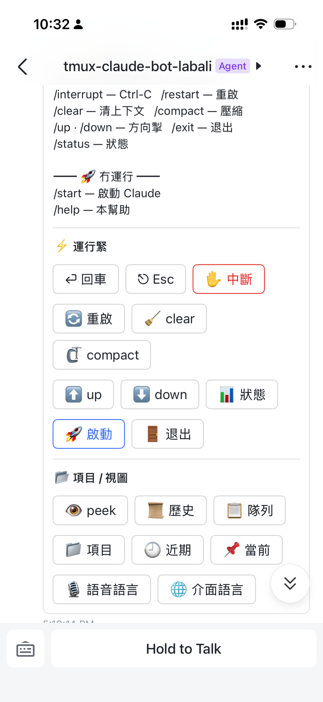

# tmux-claude-bot

Remote-control Claude Code and Codex agents running inside managed tmux sessions.

[](https://github.com/OctopusGarage/tmux-claude-bot/actions/workflows/ci.yml)
[](https://github.com/OctopusGarage/tmux-claude-bot/actions/workflows/release.yml)
[](https://www.npmjs.com/package/@octopusgarage/tmux-claude-bot)
[](package.json)
[](https://www.typescriptlang.org/)
[](https://biomejs.dev)
[](LICENSE)

`tmux-claude-bot` is a local, long-running agent orchestration service. It drives
the real Claude Code or Codex CLI through tmux, just like a person typing in the
pane. It does not replace those tools with a model API wrapper; it adds durable
remote control, scheduling, notifications, and supervised automation around the
interactive agents you already use.

<p align="center">
  
  
  
</p>

## What It Does

- Runs Claude Code and Codex inside managed tmux project sessions.
- Lets you control those sessions from Telegram, Feishu/Lark, the local CLI, or
  the terminal UI.
- Keeps one ordinary chat context per project while isolating scheduled and
  delegated automation in Loop Supervisor and Loop worker sessions.
- Keeps infrastructure agents in dedicated state workspaces while Loop workers
  run in the target project path or isolated execution worktree, so project-local
  instructions, skills, and MCP descriptors stay visible.
- Supports local voice transcription, optional local prompt translation, recent
  input replay, session history, logs, dashboards, and recovery after reboot.
- Lets local projects send notifications through the running bot without owning
  chat credentials.
- Provides Loop Engineering for recurring project health work: architecture,
  bug-fix, test-coverage, security-maintenance, harness-auto, opportunity
  discovery, and PR review.
- Provides Autopilot for owner-confirmed active delegation into the same
  supervisor-backed WorkOrder pipeline.
- Provides Daily Task Audit and Runtime Guardian so the bot can detect failed
  scheduled work and repair tmux-claude-bot-owned runtime issues.

## Quick Start

Install on macOS or Linux:

```bash
curl -fsSL https://raw.githubusercontent.com/OctopusGarage/tmux-claude-bot/main/install.sh | bash
```

Or install from npm:

```bash
npm i -g @octopusgarage/tmux-claude-bot
tmux-claude-bot setup
tmux-claude-bot run
```

Useful commands:

```bash
tcb doctor
tcb setup --reconfigure
tcb setup:lark
tcb tui
tcb dashboard
tcb service status
```

## Requirements

- Node.js 22+
- tmux
- Claude Code CLI and/or Codex CLI installed and logged in
- Telegram bot token and/or Feishu/Lark app credentials
- macOS launchd or Linux systemd for managed service mode

## User Surfaces

| Surface | Purpose |
| --- | --- |
| Telegram | Owner chat, commands, inline controls, voice prompts, notifications. |
| Feishu/Lark | Owner chat, project-bound groups, commands, cards, notifications. |
| CLI | Local control through `tcb ...` and script-friendly commands. |
| TUI | Keyboard-driven local dashboard and project control panel. |
| Scheduler | Recurring Loop Engineering, Daily Task Audit, and runtime checks. |

## Intelligent Automation

The automation platform is built around a shared execution contract:

```text
trigger
  -> WorkOrder
  -> Loop Supervisor
  -> Loop worker
  -> system gate
  -> ledger, report, notification
```

The supervisor can reason, retry, and adapt, but the bot system remains the final
gatekeeper. Completion requires durable evidence such as final summary output,
git state, PR and CI status, mergeability, branch switch-back, verification
commands, and notification delivery.

Important automation modules:

| Module | Role |
| --- | --- |
| Loop Engineering | Scheduled project and workspace health maintenance. |
| Autopilot | One-click active delegation after the owner has clarified current work. |
| Opportunity Discovery | Read-only suggestions that can later be discussed and delegated. |
| PR Review | Review and merge loop-created PRs or configured repository-wide open PRs. |
| Daily Task Audit | Daily audit of bot-hosted schedules with optional self-repair. |
| Runtime Guardian | Near-real-time self-healing for tmux-claude-bot runtime artifacts. |

See [docs/intelligent-automation.md](docs/intelligent-automation.md) and
[docs/intelligent-automation-architecture.md](docs/intelligent-automation-architecture.md)
for the full model.

## Safety Boundaries

- Allowed users and Feishu/Lark groups are explicitly configured.
- Project paths are restricted to configured workspace roots.
- Ordinary chat, supervisor orchestration, and automation workers use separate
  session contexts.
- Code-changing automation defaults to isolated worktrees.
- System gates verify output format, git state, PR status, CI, mergeability,
  branch switch-back, and notification evidence.
- GitHub automation uses the configured account with command-local `GH_TOKEN`.
- AI-backed behavior must reuse managed Claude Code or Codex sessions; this
  project does not add direct model-provider API clients.

## Documentation

Start here:

- [docs/README.md](docs/README.md) - documentation map and source-of-truth rules
- [docs/manual.md](docs/manual.md) - complete user manual
- [docs/commands.md](docs/commands.md) - Telegram and Feishu/Lark commands
- [docs/cli-reference.md](docs/cli-reference.md) - maintained `tcb` CLI surface
- [docs/tui.md](docs/tui.md) - terminal UI guide
- [docs/agents/usage-guide.md](docs/agents/usage-guide.md) - AI operator recipes
- [docs/intelligent-automation.md](docs/intelligent-automation.md) - automation
  business rules and task families
- [docs/intelligent-automation-architecture.md](docs/intelligent-automation-architecture.md)
  - automation architecture, gates, and drift controls
- [docs/automation-capability-matrix.md](docs/automation-capability-matrix.md) -
  CLI, TUI, Telegram, Feishu/Lark, and skill parity matrix
- [docs/TESTING.md](docs/TESTING.md) - local verification and testing standard

## Development

```bash
npm install
npm run setup:lark
npm run doctor
npm run service:install
npm run service:uninstall
npm run dev
npm run build
npm test
npm run lint
npm run lint:types
```

Before pushing or claiming CI readiness:

```bash
npm run verify:local
```

Deeper checks:

```bash
npm run test:coverage
npm run knip
npm run mutation
npm run audit
```

## Contributing

Contributions are welcome. See [CONTRIBUTING.md](CONTRIBUTING.md) for local dev,
verification gates, release flow, and issue-tracker conventions.

Maintained documentation, source comments, and test comments should be written in
English. Localized user-facing strings belong in i18n catalogs, UI fixtures, or
tests that intentionally verify localized behavior.

## Related

- [telegram-bridge](https://github.com/OctopusGarage/telegram-bridge) - a smaller
  Telegram-only bridge for one tmux target.
- [octopusgarage-skills](https://github.com/OctopusGarage/octopusgarage-skills) -
  shared skills for Claude Code and Codex.
- [OctopusGarage](https://github.com/OctopusGarage) - tools for AI agents, local
  automation, and browser-native products.

## License

MIT. See [LICENSE](LICENSE).
