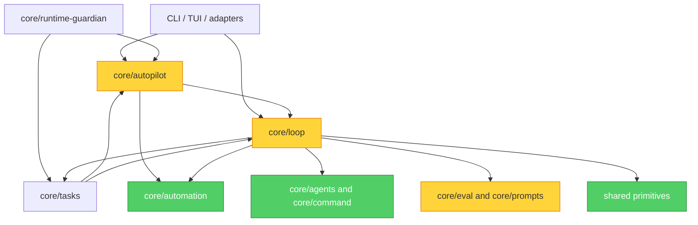

# Ralph-style iteration: repository assessment and implementation options

Status: baseline research with a completed pilot; broader proposals remain a roadmap.
Date: 2026-09-15.
Repository baseline: `1d55a6ba716850c634b2726b1bd49f77c3b28c1d`.

## Implementation status after the pilot

The assessment below describes the repository baseline above. Its source line
references, gap descriptions and proposed names are historical, not a claim
about the current runtime. Current behavior is maintained in
[Active Delegation Iteration Checkpoints](../intelligent-automation.md#active-delegation-iteration-checkpoints)
and the [alignment contract](../automation-alignment.md#active-delegation-checkpoint-boundary).

Three bounded slices are implemented for single-repository active delegations:

- `7dfdf5bf`: strict, contract-bound iteration checkpoints and handoff reporting.
- `0907c0d7`: checkpoint acceptance using actual repository state, sticky checkpoint
  requirements, durable revision budgets/deadlines and cancellation fencing.
- `180c0603`: repeat the same prompt/session for fresh partial checkpoints within
  a durable `maxRounds - 1` continuation cap; preserve normal final acceptance.

The final implementation passed `npm run verify:local`: 400 test files,
4,437 passing tests and 4 skipped tests. This supersedes the research-only
verification scope recorded near the end of the original assessment.

The complete proposed roadmap is not implemented. Independent behavioral-test
provenance, immutable iteration history, broader crash-window reconciliation,
operator progress/pause/resume controls, external-wait scheduling, workspace
support and other task-family rollout remain follow-up work. The pilot does not
add a scheduler, provider client or competing native-goal controller. Repository
state is independently checked; checkpoint sequence and test evidence remain
agent-reported. Existing valid final-summary precedence is unchanged.

## Scope and conclusion

Architecture Audit, focused on sustained engineering execution. Repository-wide
documentation, module inventory and dependency validation were combined with
source inspection of Loop Engineering, Autopilot, queue restoration, final
summary parsing, acceptance gates, handoff reports, task recovery, task policies,
and their relevant tests. This is not a line-by-line audit of every adapter,
transcription feature, UI, or host service, nor an inspection of live user jobs.
No whole-project quality score is inferred from this focused assessment.

**Recommendation: add bounded, durable engineering iterations inside the existing
WorkOrder pipeline.** Preserve its isolation, admission, recovery and acceptance
boundaries. The most valuable missing abstraction is an independently recorded
iteration that can continue unfinished work, rather than another scheduler,
agent role, provider integration, or global keep-alive feature.

The project already has agentic engineering prompts, verification-repair loops,
supervisor revision, persisted WorkOrders, recovery queues and system acceptance.
The gap is narrower: engineering progress within a supervised WorkOrder is mostly
agent-managed, while the service primarily observes dispatch and finalization.

## Module Dependency Graph

Selected current dependencies; arrows mean imports/dependencies, not dispatch order.
Directory-level reciprocal edges do not imply a file-level import cycle.



`core/loop` is the largest inspected module group (44 TypeScript files), followed
by `core/agents` (36). Loop's broad dependency set is expected in orchestration;
it is not itself evidence of a dependency-inversion defect. The meaningful seam
problem is that Autopilot imports acceptance helpers from the large Loop service,
and several lifecycle callers independently own revision progression.

## What Ralph contributes

### Sources and corrections

1. Huntley's original example repeatedly feeds a prompt file to an agent. Its
   shell example does **not** include `--continue`. Persistent engineering work
   and conversation resumption are separate concepts. [Original author](https://ghuntley.com/ralph/)
2. Anthropic's example plugin explicitly continues the current session through a
   Stop hook. A fresh context is therefore not universal to the implementations
   discussed here. [Pinned plugin README](https://github.com/anthropics/claude-code/blob/c2022d3698c2ed89a5d9ca4a724571d2819057a5/plugins/ralph-wiggum/README.md)
3. Pocock's own implementation uses a PRD, a progress file, one selected task,
   tests/type checks and commits. Its AFK script repeatedly invokes print mode
   without a resume flag. This is a different context strategy. [AIHero script](https://www.aihero.dev/getting-started-with-ralph)
4. The plugin hook reads its state and final assistant text, checks the iteration
   cap and promise, and otherwise blocks stopping with the same prompt. It does
   not independently execute tests or compare engineering progress. [Pinned hook](https://github.com/anthropics/claude-code/blob/c2022d3698c2ed89a5d9ca4a724571d2819057a5/plugins/ralph-wiggum/hooks/stop-hook.sh)
5. Its setup uses one workspace-relative state file without a WorkOrder or
   session-owner field. That is suitable evidence about a small example, not a
   substitute for this service's multi-session ownership model. [Pinned setup](https://github.com/anthropics/claude-code/blob/c2022d3698c2ed89a5d9ca4a724571d2819057a5/plugins/ralph-wiggum/scripts/setup-ralph-loop.sh)
6. Current hook documentation distinguishes normal Stop from user interruption
   and API failure, and documents an eight-consecutive-block limit. The old
   plugin's unlimited wording is not a portable runtime guarantee. Installed
   versions would need compatibility testing before a hook-based rollout.
   [Current hook reference](https://code.claude.com/docs/en/hooks#stop)

The following design is an inference from those sources and local evidence:

> Stable authorized task + durable work state + observed feedback + bounded
> continuation, with completion decided by acceptance evidence.

Keep the original mission and acceptance criteria stable. Attach the latest
checkpoint and failure evidence to each iteration. This retains the purpose of
the repeated prompt without requiring every transport payload to be identical.
An explicit user scope change creates a new contract version; it must not be
lost merely because the original prompt is repeated.

### Relationship to goals

This repository documents native agent commands as passthrough in
`docs/commands.md:137`. It explicitly permits a durable agent goal as an execution
aid while retaining WorkOrder authority in `docs/intelligent-automation.md:833`.
`docs/manual.md:412` states that the old Autopilot keep-alive and goal-cycle
implementation was removed.

Consequently, the useful project relationship is: **WorkOrder defines authorized
work; an iteration policy advances it; a native goal may help the worker execute
it; system acceptance decides success.** Avoid comparing every product's command
named `/goal` as though it had one universal implementation, or restoring removed
global goal cycling as a consequence of this proposal.

## Existing capabilities and specific gaps

| Area | Evidence in current source | Assessment |
| --- | --- | --- |
| Engineering method | `work-order.ts:633` and `prompts/loop-task-policies.ts` | Explore, plan, code, verify, review, record and task-specific rounds already exist in prompts. |
| Deterministic runner | `run.ts:1647`, `run.ts:1675`, `run.ts:1719`; asynchronous counterpart later in the file | Assesses findings, selects a bounded list, runs verification commands and bounded verification recovery. Reuse this feedback pattern. |
| Supervised dispatch | `supervised-runner.ts:186` | One initial dispatch, transient retry, and one finalization fallback; not a general unfinished-task progression loop. |
| System revision | `service.ts:901`, `service.ts:2381`, `autopilot/delegated-task.ts:1012` | Same WorkOrder can receive bounded correction prompts after gate failure. |
| Completion | `service.ts:2686`, `eval/report.ts:19` | Real Git/PR/check inspection exists; some local verification evidence is derived from the supervisor summary. |
| Durable state | `supervisor-state.ts:8`, `supervisor-report.ts:55` | WorkOrder lifecycle, revision information and terminal handoff exist; no common per-iteration engineering checkpoint contract was found. |
| Recovery | `supervisor-work-restore.ts:32`, `delegated-task.ts:647`, `tasks/project-recovery-service.ts:55` | Queue restoration, liveness reconciliation, historical task classification and linked repair dispatch already exist. |
| Isolation and admission | `agent-queue.ts`, `execution-worktree.ts`, `supervisor-pool.ts`, `automation/*` | Existing ownership and two-stage admission must surround continuation too. |

## Findings

### Warning 1: unfinished engineering work has no first-class iteration outcome

**Symptom:** `LoopSupervisedRunResult` expresses completed, blocked, cancelled and
failure outcomes. `runSupervisorPromptSequence` retries invalid final output once
with a finalization prompt. `runSupervisedSystemGateOutcome` skips acceptance for
non-completed results and returns no revision failures. Thus an agent-managed
round can continue inside a session, but the service has no common
`progress-made-but-work-remains` result that advances the next engineering step.

**Source:** `supervised-runner.ts:35,186`, `service.ts:2694`; Domain-Driven Design,
Ubiquitous Language: task progress and terminal reporting are different concepts.

**Consequence:** legitimate partial progress can be treated as an output problem
or deferred to a later repair job. The service cannot reliably distinguish
"implement the next acceptance item" from "repair the summary".

**Remedy:** introduce a versioned iteration-result protocol beneath WorkOrder.
Separate continue, completion-candidate, waiting and blocked from malformed output.
The controller validates an iteration checkpoint before scheduling another turn.
Do not equate any ordinary agent stop with permission to continue indefinitely.

### Warning 2: handoff is a report, not yet a checkpoint journal

**Symptom:** `writeLoopSupervisorReport` derives handoff from an ended run result.
It captures actions, commits, verification, risks and next steps, but does not
contain stable acceptance-item IDs, the currently selected item or an iteration
history. Queue restoration and terminal-summary reconciliation restore other
important state, not this missing engineering-progress contract.

**Source:** `supervisor-report.ts:55,185,329`, `supervisor-work-restore.ts:32`;
A Philosophy of Software Design, Information Hiding: recovery should consume a
stable work-state interface rather than reconstruct intent from transcripts.

**Consequence:** a process failure before final reporting may leave useful Git
work and transcripts without a verified next-step checkpoint. Fresh context then
requires rediscovery and can repeat work.

**Remedy:** record every accepted iteration under the existing run artifact
directory and derive human-readable handoff from it. Preserve the existing final
reports as compatible projections. A checkpoint must distinguish verified work,
agent claims, and a dirty/incomplete attempt requiring reconciliation.

### Warning 3: verification provenance is too weak for automatic task completion

**Symptom:** `buildEvalReportFromSupervisorSummary` transforms agent reporting;
string deterministic gates become `passed`. `evalOutcomeForSummary` can return
passed from summary status and finalVerification. WorkOrder validation requires
planReview presence but does not map every acceptance criterion to a verified
artifact. The system gate independently checks important repository and PR facts,
but is not a general runner for the task's local acceptance commands.

**Source:** `eval/report.ts:19,91,128`, `final-summary-contract.ts:102`,
`service.ts:2686`; Code Complete, defensive boundary validation.

**Consequence:** a well-formed final claim is stronger evidence than plain text,
but does not prove that every required behavior passed on the delivered revision.
Repeated execution alone would amplify this weakness.

**Remedy:** add acceptance-item IDs and evidence provenance. For supported tasks,
run configured, approved deterministic verification through the bot's command
boundary, or verify authoritative CI evidence. Bind results to WorkOrder contract
version and repository revision. Keep agent review as separately labeled evidence.
Never execute arbitrary commands copied from untrusted output as a new privilege.
Reuse the existing deterministic runner's invocation/result abstractions.

This is a contract-gap assessment, not a claim that a false completion occurred
in production. Existing PR gates and tests remain valuable protections.

### Warning 4: revision bounds are local to lifecycle callers

**Symptom:** scheduled execution, recovered execution and active delegation each
initialize a local `revisionAttempt = 0`. State can contain `revisionAttempt`, but
the recovered loop initializes its local counter again. Active delegation gives
each revision the same two-hour timeout as initial execution. The inspected
WorkOrder state does not carry one cumulative execution deadline or progress
budget across these paths.

**Source:** `service.ts:901,2381`, `delegated-task.ts:1012,1032`,
`supervisor-state.ts:16`; The Pragmatic Programmer, DRY: one budget decision should
have one owner.

**Consequence:** an attempt cap or timeout for one invocation is not necessarily
a cap for the full WorkOrder lifetime. Reconciliation may reopen allowance unless
the durable policy explicitly prevents it. Existing recovery dead letters and
admission controls mitigate other layers; they do not define an engineering
iteration budget.

**Remedy:** persist iteration and transport-retry consumption, cumulative active
execution time, waiting time, and an explicit lifetime deadline policy. Resume
from consumed allowance. Classify quota waits, owner decisions, failed checks and
unchanged evidence separately; do not spend agent turns polling external CI.
Use failure fingerprints already present in recovery as inputs, not a second
repair coordinator. Test restart behavior before calling the budget global.

### Warning 5: continuation policy is distributed across service entry points

**Symptom:** the three lifecycle callers independently sequence summary recovery,
gate execution, revision state writes and redispatch. Autopilot imports these
acceptance helpers from Loop's service module. Changes to continuation therefore
need coordinated policy edits across scheduled, delegated and recovered paths.

**Source:** `service.ts:894,2373`, `delegated-task.ts:1004`;
Refactoring, Duplicate Code; A Philosophy of Software Design, deep modules.

**Consequence:** adding another Ralph dispatcher or native Stop controller would
multiply opportunities for cancellation, reset and retry policies to diverge.

**Remedy:** extract one small transition policy used by existing entry points.
Keep triggers, task-family policy and final resource settlement in their current
owners. Introduce no new queue, supervisor role, evaluator service or scheduler.

### Testability and architecture qualifications

The existing injected dispatch, runCommand and runGit seams support deterministic
testing; no wholesale inversion-of-control rewrite is needed. Dependency-cruiser
reported no configured violations. Team ownership is unknown, so no Conway's Law
claim is made. No unrelated module split or broad cleanup is recommended.

## Where to adopt the pattern

| Area | Priority | Concrete adaptation and stopping boundary |
| --- | --- | --- |
| Autopilot active delegation | First pilot | Advance an approved checklist one verified slice at a time; stop at acceptance, cancellation, proven blocker or budget. |
| Bug fix | High | Reproduce, repair, run regression, checkpoint; stop when scoped confirmed bugs are resolved. |
| Test coverage | High | Select uncovered behavior, add meaningful tests, measure coverage; retain risk-path acceptance rather than rewarding percentage alone. |
| Architecture | Next | Reassess after each accepted slice; freeze the rubric, keep existing score-first gate, stop when target is reached or no justified candidate remains. |
| Security maintenance | Next | Repeat confirmed reachable remediation; preserve deterministic pre-dispatch risk gate and action allowlist. |
| Harness-auto | Later | Share one parent budget across enabled subtasks; reassess after a slice, avoid multiplying parent and child loop limits. |
| PR review | Narrow use | Continue bounded same-repository repairs; wait for external CI without another coding turn; preserve head-specific acceptance and merge policy. |
| Daily audit / Project Recovery / Runtime Guardian | Integrate after pilot | Resume the existing task when authorized and ownership is clear; otherwise retain linked recovery semantics and terminal closures. Runtime repair still targets the bot only. |
| Opportunity Discovery | Read-only iteration only | Improve proposal evidence, but implementation requires the existing confirmed delegation boundary. |
| Chat / CLI / TUI / MCP / installed skills | Expose state | Display current item, iteration, verified progress and stop reason; reuse existing command families and shared projections. |
| Notifications / translation / transcription / host power / resource sampling | No engineering loop | These are transport, deterministic processing or host-policy boundaries. They may report or gate work, not invent additional task continuation. |

The current architecture workflow skill already says one candidate per round,
verification and rescoring (`.agents/skills/arch-loop/SKILL.md:51`). Preserve it as
a procedure; move mechanically enforceable progress/budget rules into runtime
contracts where unattended execution depends on them.

## Implementation alternatives

| Option | Benefit | Cost / limitation | Decision |
| --- | --- | --- | --- |
| Add stronger repeated-prompt instructions only | Smallest change; useful procedural guidance | Cannot reliably enforce checkpoints, acceptance or restart budgets | Supporting improvement only |
| Install Ralph Stop hooks in automation sessions | Direct reuse of the example | Claude-specific lifecycle, competing controllers, runtime compatibility and single-file state concerns | Not the platform foundation |
| Extend the existing WorkOrder executor with durable iteration policy | Cross-agent behavior, shared budgets and acceptance | Requires schema, state, queue and reporting integration | Recommended, incrementally |

## Proposed execution contract

All names below are design names, not available commands or existing schema fields.

### Stable task and changing progress

Keep WorkOrder as the authority. Add opt-in policy and versioned artifacts:

- Contract: goal, acceptance items with stable IDs, allowed scope/actions,
  verification requirements, non-goals, task-family stop policy and contract hash.
- Iteration: sequence, selected item, attempt identity, context strategy, starting
  and ending revision, observed changes, verification references, blocker/next step.
- Progress: pending, in-progress, verified and blocked items. "Deferred" required
  work remains incomplete unless an authorized scope update explicitly removes it.
- Budget: work iterations, transport retries, repeated-failure allowance and
  cumulative time/deadline policy. Exact defaults follow pilot measurements.

Suggested artifacts inside the existing run directory are immutable
`iterations/<sequence>.json` plus an atomically replaced `progress.json` projection.
The latest checkpoint is referenced by the existing state and handoff records.
Do not introduce a generic event-sourcing platform: make crash boundaries explicit
using the current atomic-write facilities and a small reconciliation routine.

### One transition owner

```text
existing trigger -> existing admission and WorkOrder reservation
  -> load contract, checkpoint and remaining allowance
  -> reconcile active attempt / actual repository state
  -> dispatch one bounded turn through the existing queue
  -> collect iteration result and independently observed evidence
  -> decide:
       continue -> checkpoint -> recheck admission -> next turn
       completion-candidate -> acceptance -> existing final gates/settlement
       waiting -> checkpoint + retry condition; release execution capacity
       blocked / exhausted / cancelled -> preserve evidence; terminal policy
```

This operates after the managed queue declares a turn settled. A missing process,
uncertain cancellation or surviving active worker is a reconciliation case, not
permission to issue another prompt. Allow at most one active attempt per WorkOrder.
Reject stale results using attempt identity plus current ownership generation.
Exactly-once external execution cannot be promised across crashes; use durable
attempt identity, idempotent reconciliation and side-effect lookup before retry.

Keep transport retries, engineering iterations, finalization repair, acceptance
revision and later scheduled occurrences distinct. A new daily occurrence is not
automatically the next iteration of yesterday's authorized task.

### Context policy and native goals

Reuse the current worker for consecutive steps when its context is healthy.
Compact or replace it only with a verified reconstruction packet: stable task,
current item, repository/revision, relevant previous failure, verification evidence
and the next action. Preserve clear/reset rules for unrelated WorkOrders.

If a native goal controls turns inside a worker, the bot sees that as one active
attempt until it settles. Do not concurrently let a plugin hook and the bot each
own the next dispatch. Integrating native lifecycle events is a later adapter
optimization, not required for the first WorkOrder iteration implementation.

### Acceptance, budgets and scope

Completion requires every mandatory acceptance item to have adequate current
evidence, plus existing final Git/PR/CI/notification gates as applicable. Evidence
records include command/check identity, exit result, artifact, repository revision
and contract version. For a workspace, bind evidence to each member revision.
A reused passing result is valid only under an explicit dependency/revision rule.

A clean tree, an extra commit or a changed progress file is not sufficient proof
of progress. Count meaningful acceptance changes, newly resolved failures and
bounded investigation evidence. A read-only diagnostic turn can make progress.
Repeated identical evidence should trigger a different bounded diagnostic action
or a stop; arbitrary numerical score fluctuation should not keep a task alive.

Separate working time from external waiting. Define whether the lifetime deadline
continues during pauses. Store its decision durably; restart must not reset it.
When quota or quiet hours prevent another round, reuse existing admission deferral.
Persist workspace reservation policy separately from execution-capacity release,
so waiting does not allow concurrent branch mutations.

Intermediate accepted slices can commit to the existing WorkOrder branch.
Publish or update one coherent PR according to existing policy. Run focused
verification after a slice and the required broader gates before final delivery.
Keep failed/unverified changes visibly marked; never silently discard them to make
the checkpoint look clean or create an empty commit as progress evidence.

## Reviewable rollout slices

1. **Durable checkpoint and evidence contract.** Add opt-in types, artifact
   validation and one checkpoint-recording path for a bounded active delegation.
   Include revision binding and task-item completion rules. Keep dispatch behavior
   unchanged. Verify corrupt/missing/stale artifacts and backward reading.
2. **One shared iteration decision policy.** Extract policy from the three current
   revision callers without changing their behavior, then enable bounded
   continuation for the pilot only. Preserve cancellation and output repair as
   separate transitions. Persist allowance before dispatch.
3. **Crash recovery and operator controls.** Reconcile dispatch/checkpoint crash
   windows; display progress, stop reason and remaining allowance. Extend existing
   command families with safe status/pause/resume only after their exact semantics
   are defined. No manual state-file editing recipe.
4. **Task-family rollout.** Adopt bug-fix and test-coverage profiles, then
   architecture/security, then parent-budget harness and governed repair flows.
   Stop after each slice for review; do not combine this with general cleanup.

For every behavioral slice, update `docs/intelligent-automation.md`, relevant
`docs/automation-alignment.md` rows, the capability matrix, applicable usage/CLI/
chat/TUI/MCP/skill surfaces, and focused contract tests. Runtime state stays in the
configured state directory, not in maintained docs or synthetic fixtures copied
from live user configuration. Rollback disables new dispatch while preserving
in-flight ownership and artifacts; it must not erase checkpoints or budgets.

### Required acceptance scenarios for implementation

- Three required items: stop after item one, then complete two and three without
  repeating verified work or creating a second WorkOrder/branch/PR.
- Agent claims completion while a required item is pending: acceptance fails.
- Verification is for an older revision or different contract: evidence rejected.
- Repeated unchanged failure: bounded diagnostic change or explicit exhaustion.
- Crash before enqueue, after enqueue, after commit and after checkpoint: no
  duplicate active worker, no repeated commit/PR side effect, correct next step.
- Restart during revision: consumed attempts and elapsed allowance retained.
- Cancel, late completion and shutdown race: no late success or next dispatch.
- External CI/quota/quiet-hours wait: no busy agent polling; admission rechecked.
- Native goal still active: no competing continuation prompt.
- Source path mismatch, dirty user tree or workspace member mismatch: block using
  existing isolation policy; never guess the target.
- No-delta success remains valid when all acceptance evidence is current.
- Pending mandatory work cannot become success through a generic follow-up entry.

Measure accepted-item completion rate, repeated-work rate, progress per active
minute, failure recurrence, false-completion rejection, resume success and owner
intervention. More iterations and more commits are not success metrics. Start with
the opt-in pilot and expand only after these scenarios and observed runs support it.

## Verification performed for this assessment

- `npx vitest run tests/loop/supervised-runner.test.ts tests/loop/supervisor-report.test.ts tests/core/eval/report.test.ts tests/loop/service-supervisor.test.ts tests/autopilot/delegated-task-supervisor-pool.test.ts tests/loop/run.test.ts`
  — 6 files, 209 tests passed.
- `npx depcruise src --config .dependency-cruiser.cjs --output-type err`
  — no dependency violations; 403 modules and 2,025 dependencies checked.

These validate inspected existing behavior, not the proposed implementation.
No live automation, plugin installation, provider request, deployment or push was
performed. Full `npm run verify:local` was not run; this is not a CI-readiness claim.

## Summary

The first useful experiment is an approved multi-item Autopilot task that advances
through durable, verifiable iterations and survives a restart. Its checkpoint,
acceptance and budget semantics should become reusable policy inside the existing
WorkOrder pipeline. Repeating the prompt is the easy part; preserving what counts
as progress, authorization and completion is the engineering work.
